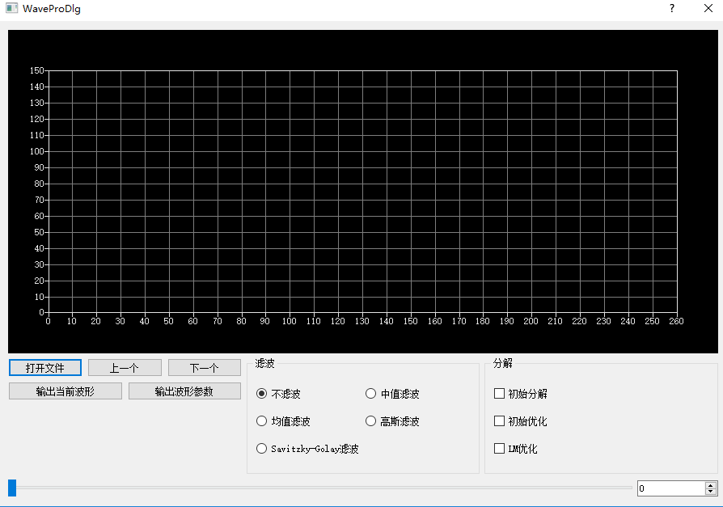
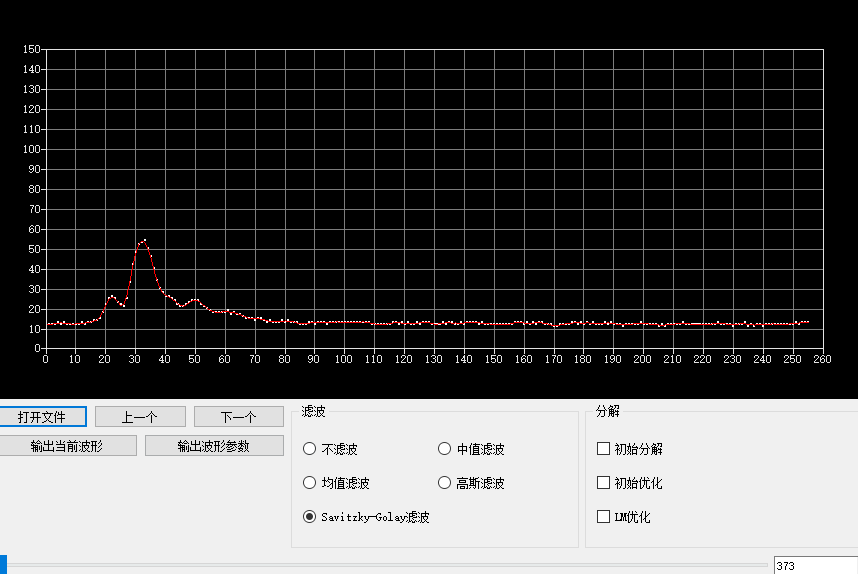
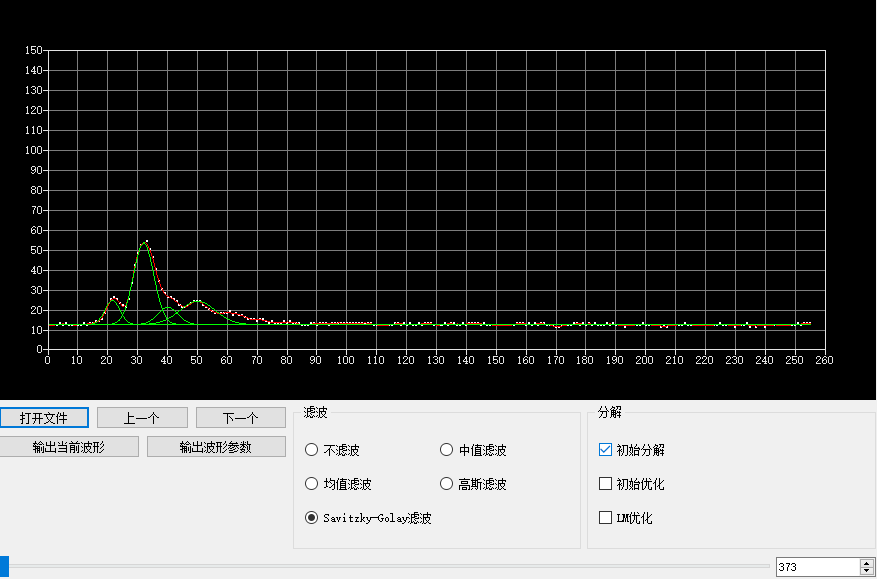
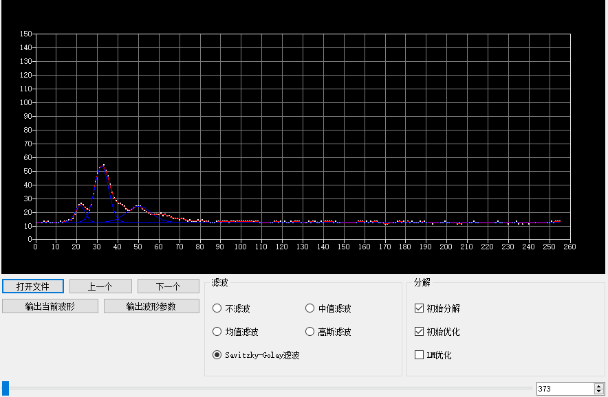
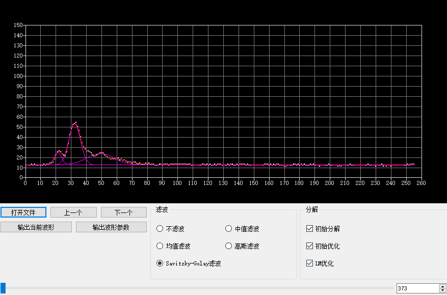

# LASWaveViewer
LAS1.3 Waveform Data Viewer
## 功能说明
基于Qt5的LAS1.3波形数据显示处理程序。   
程序主界面：

滤波：

初始分解：

初始优化：

LM优化：

## 依赖库
修改了liblas库以支持LAS1.3波形数据的读取

Eigen3 see [https://github.com/eigenteam/eigen-git-mirror](https://github.com/eigenteam/eigen-git-mirror)

Boost see [https://www.boost.org](https://www.boost.org)
